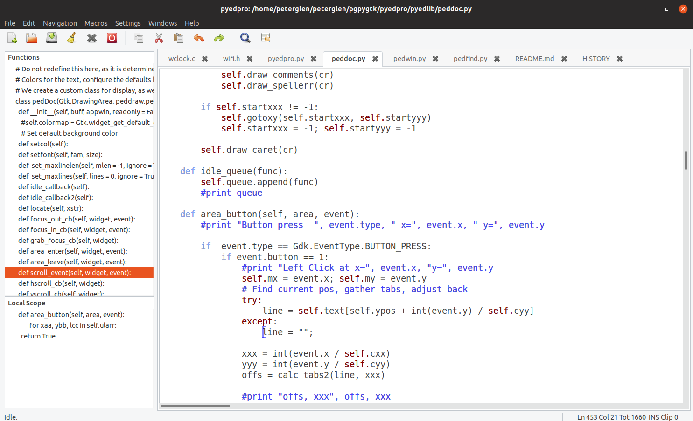

#   PyEdPro README

## Python editor.
 
   Welcome to PyEdPro. This is modern multi-platform editor. Simple, powerful, 
configurable, extendable. Goodies like macro recording / playback, spell check,
column select, multiple clipboards, unlimited undo ... makes it an editor 
that I use every day.

 This project is a successor of pyedit, after porting it to GTK3.

  Working platforms currently are: 
  
                Win 7 .. Win 10 ...
                Centos 6 .. 7 Ubunto 14 ... 16 (all linux platforms) ...
                Msys, Msys2, Mingw, Raspberry PI ... 
                
                practically anywhere PyGTK can run.
 
  I mainly run it in MSYS2, Ubuntu and the Raspberry-Pi, and it behaves consistently
on all three platforms.
 
   PyEdPro.py has macro recording/play, search/replace, functional navigation,
comment/string spell check, auto backup, persistent undo/redo, auto complete,
auto correct, syntax check, spell suggestion ... and a lot more.
   
   It is fast, it is extendable, as python lends itself to easy extending. The
editor has a table driven key mapping. One can easily edit the key map in
keyhand.py, and the key actions in acthand.py

The default key map resembles gedit / wed / etp / brief. Full ASCII; 
 Any fixed font can be configured. 

  See KEYS file for the list of keyboard shortcuts or press F3 in the
editor or look at the file in pyedlib/KEYS.

  On initial start, PyEdPro shows a left pane and a top pane. The left pane 
is for function summary and the top pane is for double view of the same file.
(to see the caller and the callee) These panes can be hidden with the mouse by 
dragging on their handle, or by the key combination Alt-Q (Shift-Alt-Q for
the left pane) 

 PyEdPro remembers a lot about the editing session. Loaded files, cursor positions,
fonts, font size, colors, search strings, goto numbers, undo / redo info,
window positions ... and more.
 This is all stored in the directory ~/.PyEdPro. You may safely delete that 
directory to start PyEdPro with no memory of what has been done.

  Starting PyEdPro with no command line arguments will put you back to the 
 previous session, exactly where you left off.

 The editor will work on Windows, and can open UNIX and Windows files
transparently. It will save the file as the current platform's native 
convention dictates.

  Developer's note: in order to make PyEdPro multi platform, we save
the configuration info into a SQLite database in the ~/.PyEdPro directory.

     (~/ stands for the user's home directory)

 Contributors are welcome. Requires python and pygtk / pygobject.

 
  Peter Glen

Screen from Ubuntu:

